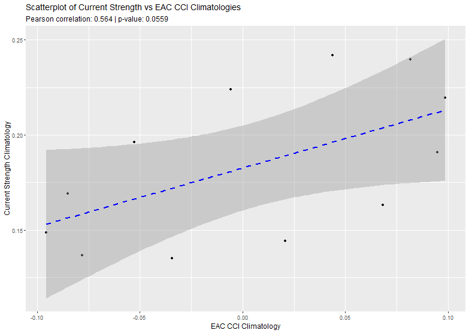
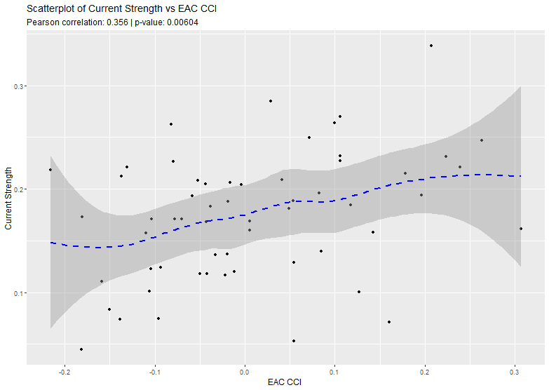

```{r}
# load libraries  
library(tidyverse) 
library(marginaleffects) 
library(gglm)
```

## Results

### Climatology comparison

The climatologies of the Index and the Mean Monthly Strength did not have a significant correlation between them (Pearson correlation = 0.564, p = 0.0559).




### Relationship between Index values and Mean Monthly Strength

The raw values of the two were compared, there was statistically significant correlation between the two (Pearson = 0.356, p = 0.006)



To further explore the relationship between the output of the Index and the calculated mean monthly strength values, multiple linear regression models were calculated.

#### Raw: EAC strength vs. copepod index

```{r}


# data wrangling

# Extract data sources
raw_data <- readRDS(file.path("var", "raw_data_list.rds"))

raw_strength_data <- raw_data$raw_strength_data
raw_index_data <- raw_data$raw_index_data
str_clim <- raw_data$str_clim

# combine raw data values

comb_raw_data <- raw_strength_data %>% 
  full_join(raw_index_data, by = "date") %>%  
  mutate(
    month = month(date) # extract month value
  ) %>% 
  rename(mean_strength = mean_vel) %>% 
  filter(!is.na(mean_strength) & !is.na(eac_cci))

comb_raw_data <- comb_raw_data %>% 
  inner_join(str_clim, by = "month")


head(comb_raw_data)


```

There are no samples taken in January, so the data only covers the period from February to December.

A multiple linear regression was conducted to examine the relationship between the Index values and the mean monthly strength.

```{r}

# create the model

cci_str_model <- lm(eac_cci ~ mean_strength, data = comb_raw_data)

summary(cci_str_model)

```

The overall model was statistically significant, *F(*1, 56) = 8.146, *p* = 0.006, explaining approximately 11% of the variance in the dependent variable (*R²* = 0.127, adjusted *R²* = 0.111).

Residuals were symmetrically distributed with a standard error of 0.1153 (df = 56), ranging from -0.255 to 0.308, suggesting that the model does not under or overfit.

A second regression was conducted to understand the seasonal variation.

```{r}
# Index against strength climatology
cci_str_model2 <- lm(eac_cci ~ month_clim_str, data = comb_raw_data)
# month_clim_str is the strength climatology value.

summary(cci_str_model2)

```

This model was not statistically significant, F(1, 56) = 1.426, p = 0.238, explaining very little variance in the dependent variable (*R²* = 0.025, adjusted *R²* = 0.007).

Residuals were symmetrically distributed with a standard error of 0.12, ranging from -0.234 to 0.291.

Finally, we calculate the total variation in CCI that is explained by the seasonal and total variation in current. We calculate the non-seasonal component as the difference between the variance explained by the nested models.

```{r}
# Index against strength climatology
cci_str_model3 <- lm(eac_cci ~ month_clim_str + mean_strength, data = comb_raw_data)

summary(cci_str_model3)
```

The overall model was statistically significant, *F(*2, 55) = 4.003, *p* = 0.024, explaining approximately 9.5% of the variance in the dependent variable (*R²* = 0.127, adjusted *R²* = 0.095).

Residuals were symmetrically distributed with a standard error of 0.1163 (df = 55), ranging from -0.255 to 0.308, suggesting that the model does not under or overfit.

We test the significance of the non-seasonal component with ANOVA of the nested models.

```{r}
# compare the two models 

anova(cci_str_model2, cci_str_model3, test = "F")
```

The comparison revealed that Model 3 provided a better fit to the data than Model 2, *F*(1, 55) = 6.44, *p* = 0.014.

This suggests that the monthly mean strength value explains more of the variance in the EAC CCI than the strength climatology alone

Diagnostics of Model 3 show that the values have a fairly normal distribution.

```{r}

# look at model 1

gglm(cci_str_model3)


```

A plot showing the model’s predicted values for different mean strength values, overlaid with actual raw data points to visualize the model's fit to the observed data.

```{r}


plot_predictions(cci_str_model3, condition = "mean_strength") +
  geom_point(data = comb_raw_data,
             aes(x = mean_strength, y = eac_cci))
```

## Mooring Array

## Comparing the anomalies

Anomalies were calculated by subtracting the climatology value from the strength/index value, for example, `strength_anom = mean_str - str_clim`.


There was no correlation between the two (Pearson correlation = -0.043, p = 0.749).

```{r}

# Extract data sources
combined_anomaly_data <- readRDS(file.path("var", "combined_anomalies.rds"))

head(combined_anomaly_data)

```

The combined_anomalies2 tibble has 2 key variables:

1.  index_anom : The Index anomalies

2.  strength_anom : The strength anomalies calculated from the Copernicus data

```{r}
# prepare data for analysis
combined_anomaly_data <- combined_anomaly_data %>% 
  mutate(month = month(trip_month)) 

head(combined_anomaly_data)  

combined_anomaly_data_long <- combined_anomaly_data %>% 
  pivot_longer(cols = c(index_anom, strength_anom),
               names_to = "anomaly_type",
               values_to = "value") 

combined_anomaly_data_long$month <- as.factor(combined_anomaly_data_long$month)


head(combined_anomaly_data_long)


```

```{r}
# model to compare the anomalies of the Index and the Strength values
anomaly_model <- lm(value ~ anomaly_type * month, data = combined_anomaly_data_long)

summary(anomaly_model)

```

The model was not statistically significant, *F*(21, 94) = 1.47, *p* = 0.1081, and explained only a 7.9 %of the variance in the Index anomalies (*R²* = 0.247, adjusted *R²* = 0.079).

The residuals were approximately symmetrically distributed, with a standard error of 0.0851, and ranged from -0.223 to 0.214.

Neither anomaly type, month, nor their interaction had a significant effect on value**.**

```{r}
# model to compare the anomalies of the Index and the Strength values
anomaly_model2 <- lm(value ~ anomaly_type + month, data = combined_anomaly_data_long)

summary(anomaly_model2)
```

The model was not statistically significant, *F*(11, 104) = 1.245, *p* = 0.2675, and explained only 2.3 % of the variance in the Index anomalies (*R²* = 0.116, adjusted *R²* = 0.023).

The residuals were approximately symmetrically distributed, with a standard error of 0.0851, and ranged from -0.209 to 0.205.

```{r}
gglm(anomaly_model)

gglm(anomaly_model2)

```

## North vs South

```{r}
# load north and south data
cci_data_n <- readRDS(file.path("var", "eac_cci_north.rds"))

samples_n <- cci_data_n$samples
rda_fit_n <- cci_data_n$rda_fit
lm_fit_n <- cci_data_n$lm_fit
climatology_n <- cci_data_n$climatology
month_data_n <- cci_data_n$month_data # monthly average Index value

cci_data_s <- readRDS(file.path("var", "eac_cci_south.rds"))

samples_s <- cci_data_s$samples
rda_fit_s <- cci_data_s$rda_fit
lm_fit_s <- cci_data_s$lm_fit
climatology_s <- cci_data_s$climatology
month_data_s <- cci_data_s$month_data # monthly average Index value

```
