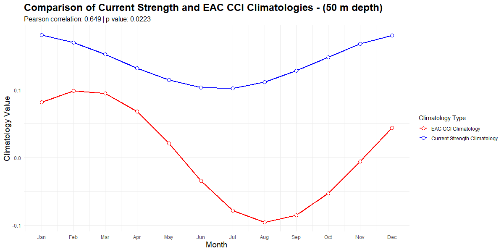
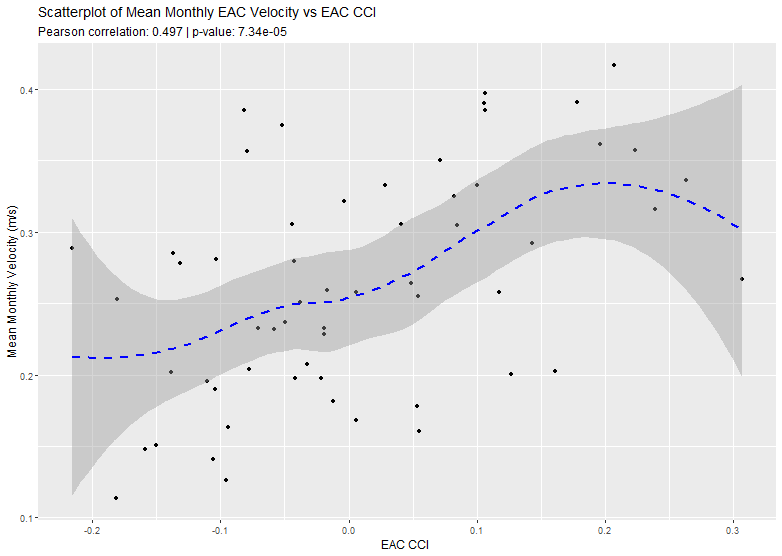
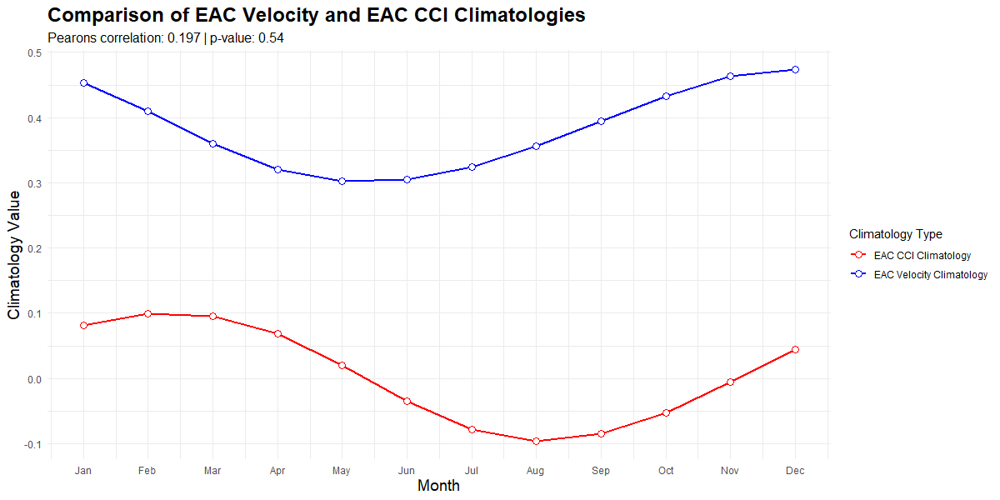
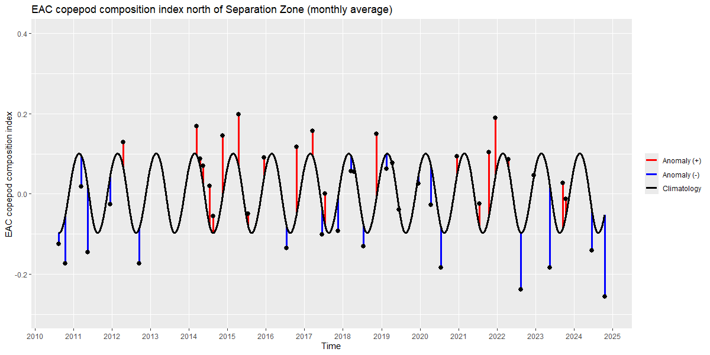
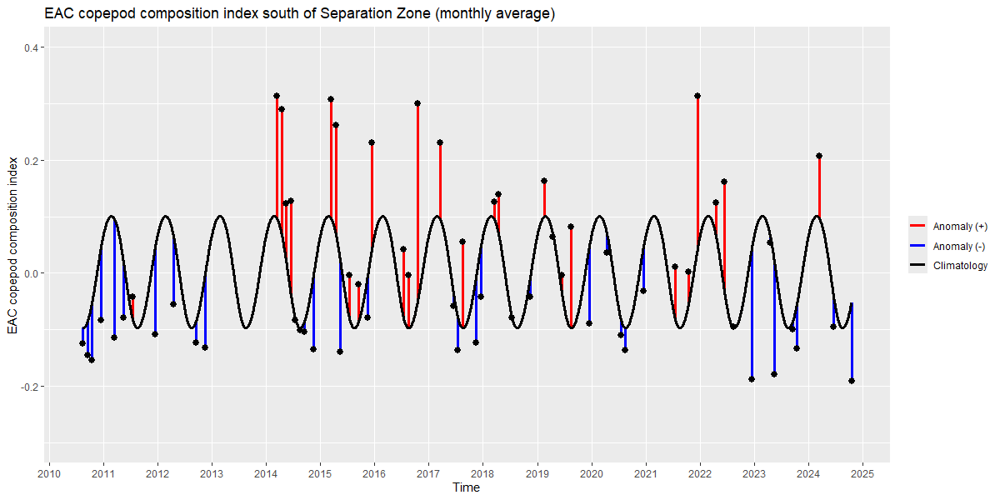

```{r}
# load libraries  
library(tidyverse) 
library(marginaleffects) 
library(gglm)
```

# Results

## Climatology comparison

The climatologies of the Index and the Mean Monthly Strength showed a significant correlation between them (Pearson correlation = 0.673, p = 0.0165).

::: {layout-ncol="2"}
{.lightbox}

{.lightbox}
:::

## Relationship between Index values and Mean Monthly Strength

The raw values of the two were compared, there was statistically significant correlation between the two (Pearson = 0.497, p \< 0.001).

{.lightbox}

To further explore the relationship between the output of the Index and the calculated mean monthly strength values, multiple linear regression models were calculated.

### Raw: EAC strength vs. copepod index

```{r}


# data wrangling

# Extract data sources
raw_data <- readRDS(file.path("var", "raw_data_list.rds"))

raw_strength_data <- raw_data$raw_strength_data
raw_index_data <- raw_data$raw_index_data
str_clim <- raw_data$str_clim

# combine raw data values

comb_raw_data <- raw_strength_data %>% 
  full_join(raw_index_data, by = "date") %>%  
  mutate(
    month = month(date) # extract month value
  ) %>% 
  rename(mean_strength = mean_vel) %>% 
  filter(!is.na(mean_strength) & !is.na(eac_cci))

comb_raw_data <- comb_raw_data %>% 
  inner_join(str_clim, by = "month")


head(comb_raw_data)


```

There are no samples taken in January, so the data only covers the period from February to December.

A multiple linear regression was conducted to examine the relationship between the Index values and the mean monthly strength.

```{r}

# create the model

cci_str_model <- lm(eac_cci ~ mean_strength, data = comb_raw_data)

summary(cci_str_model)

```

The overall model was statistically significant, *F(*1, 56) = 18.33, *p* = \< 0.001, explaining approximately 23% of the variance in the dependent variable (*R²* = 0.247, adjusted *R²* = 0.233).

Residuals were symmetrically distributed with a standard error of 0.107 (df = 56), ranging from -0.242 to 0.297, suggesting that the model does not under or overfit.

A second regression was conducted to understand the seasonal variation.

```{r}
# Index against strength climatology
cci_str_model2 <- lm(eac_cci ~ month_clim_str, data = comb_raw_data)
# month_clim_str is the strength climatology value.

summary(cci_str_model2)

```

This model was not statistically significant, F(1, 56) = 3.716, p = 0.238, explaining approximately 4.6% of the variance in the dependent variable (*R²* = 0.062, adjusted *R²* = 0.046).

Residuals were symmetrically distributed with a standard error of 0.12 (df = 56), ranging from -0.237 to 0.278.

Finally, we calculate the total variation in CCI that is explained by the seasonal and total variation in current. We calculate the non-seasonal component as the difference between the variance explained by the nested models.

```{r}
# Index against strength climatology
cci_str_model3 <- lm(eac_cci ~ month_clim_str + mean_strength, data = comb_raw_data)

summary(cci_str_model3)


cci_str_model4 <- lm(mean_strength ~ eac_cci, data = comb_raw_data)

summary(cci_str_model4)
```

The overall model was statistically significant, *F(*2, 55) = 9.066, *p* \< 0.001, explaining approximately 22% of the variance in the dependent variable (*R²* = 0.248, adjusted *R²* = 0.221).

Residuals were symmetrically distributed with a standard error of 0.108 (df = 55), ranging from -0.244 to 0.294, suggesting that the model does not under or overfit.

### Model comparison

We test the significance of the non-seasonal component with ANOVA of the nested models.

```{r}
# compare the two models 

anova(cci_str_model2, cci_str_model3, test = "F")
```

The comparison revealed that Model 3 provided a better fit to the data than Model 2, *F*(1, 55) = 13.58, *p* \< 0.001.

This suggests that the monthly mean strength value explains more of the variance in the EAC CCI than the strength climatology alone

### Model diagnostics

Diagnostics of Model 3 show that the values have a fairly normal distribution.

```{r}

# look at model 3

gglm(cci_str_model3)


```

A plot showing the model’s predicted values for different mean strength values, overlaid with actual raw data points to visualize the model's fit to the observed data.

```{r}


plot_predictions(cci_str_model3, condition = "mean_strength") +
  geom_point(data = comb_raw_data,
             aes(x = mean_strength, y = eac_cci))

plot_predictions(cci_str_model3, condition = "month_clim_str") +
  geom_point(data = comb_raw_data,
             aes(x = month_clim_str, y = eac_cci))

plot_predictions(cci_str_model3, condition = "mean_strength", points= 0.25)

plot_predictions(cci_str_model3, condition = "month_clim_str", points= 0.25)
```

## Mooring Array

Climatologies of the Index and the observational data from the mooring array were compared, however there was no significant correlation (Pearson correlation = 0.204, p = 0.526)

::: {layout-ncol="2"}
{.lightbox}

{.lightbox}
:::

The velocity data was plotted first against the full index values, and then against just the index values from the Northern region of the EAC. However, while the Pearson correlation value changed, the significance did not (p = 0.08)

::: {layout-ncol="2"}
{.lightbox}

{.lightbox}
:::

Linear regressions were run on the data from the mooring array against the results of the full index.

```{r}
# load mooring array data

mooring_data <- readRDS(file.path("var", "mooring_data_list.rds"))

mooring_vel_data <- mooring_data$mooring_vel_data 
moor_clim <- mooring_data$moor_clim

comb_moor_data <- mooring_vel_data %>% 
   full_join(moor_clim, by = "date") %>% 
  mutate(
    month = month(date)
  )

head(comb_moor_data)

```

A linear regression was conducted to examine the relationship between the Index values and the observed mean monthly velocity.

```{r}
# create the model

cci_moor_model <- lm(eac_cci ~ mean_vel, data = comb_moor_data)

summary(cci_moor_model)
```

The overall model was not statistically significant, *F(*1, 33) = 0.007, *p* = 0.935, explaining very little of the variance in the dependent variable (*R²* = 0.0002, adjusted *R²* = -0.03).

Residuals were symmetrically distributed with a standard error of 0.1048 (df = 33), ranging from -0.168 to 0.230, suggesting that the model does not under- or overfit.

A second regression was conducted to understand the seasonal variation.

```{r}
# Index against velocity climatology 
cci_moor_model2 <- lm(eac_cci ~ vel_clim, data = comb_moor_data) # vel_clim is the  climatology value.  

summary(cci_moor_model2) 
```

This model was also not statistically significant, *F(*1, 33) = 1.209, *p* = 0.2796, explaining less than 1% of the variance in the dependent variable (*R²* = 0.035, adjusted *R²* = 0.006).

Residuals were symmetrically distributed with a standard error of 0.1029 (df = 33), ranging from -0.165 to 0.199, suggesting that the model does not under- or overfit.

Finally, we calculate the total variation in CCI that is explained by the seasonal and total variation in current. We calculate the non-seasonal component as the difference between the variance explained by the nested models.

```{r}
# Index against velocity and climatology 
cci_moor_model3 <- lm(eac_cci ~ vel_clim + mean_vel, data = comb_moor_data)  

summary(cci_moor_model3)
```

This model was not statistically significant , *F(*2, 32) = 0.722, *p* = 0.493, explaining very little of the variance in the dependent variable (*R²* = 0.043, adjusted *R²* = -0.017).

Residuals were symmetrically distributed with a standard error of 0.1041 (df = 32), ranging from -0.163 to 0.198, suggesting that the model does not under- or overfit.

The results of the regression against the full index were not significant, possibly because the index covers the whole of the EAC and the mooring array is only at 27 S latitude.

### Observed Velocity against the EAC CCI from the Northern part of the EAC

The regressions were then run again, using only index values from the northern part of the EAC.

```{r}
# load northern Index values 
cci_north_data <- readRDS(file.path("var", "eac_cci_north_list.rds"))

cci_north <- cci_north_data$cci_north

comb_moor_data_north <- comb_moor_data %>%  
  full_join(cci_north, by = "date")

head(comb_moor_data_north)
```

First the linear regression of the index against mean velocity.

```{r}
# initial model 

cci_moor_model_n <- lm(cci_north ~ mean_vel, data = comb_moor_data_north)

summary(cci_moor_model_n)
```

This model was not statistically significant , *F(*1, 23) = 0.13, *p* = 0.722, explaining very little of the variance in the dependent variable (*R²* = 0.006, adjusted *R²* = -0.038).

Residuals were symmetrically distributed with a standard error of 0.1041 (df = 32), ranging from -0.201 to 0.169, suggesting that the model does not under- or overfit.

A second regression was conducted to understand the seasonal variation.

```{r}
# Index against velocity climatology  
cci_moor_model_n2 <- lm(cci_north ~ vel_clim, data = comb_moor_data_north) # vel_clim is the  climatology value.    

summary(cci_moor_model_n2) 
```

This model was statistically significant, *F(*1, 23) = 9.145, *p* = 0.006, explaining approximately 25% of the variance in the dependent variable (*R²* = 0.285, adjusted *R²* = 0.253).

Residuals were symmetrically distributed with a standard error of 0.0933 (df = 23), ranging from -0.192 to 0.146, suggesting that the model does not under- or overfit.

Finally, we calculate the total variation in CCI that is explained by the seasonal and total variation in current. We calculate the non-seasonal component as the difference between the variance explained by the nested models.

```{r}
# Index against velocity and climatology  
cci_moor_model_n3 <- lm(cci_north ~ vel_clim + mean_vel, data = comb_moor_data_north)    
summary(cci_moor_model_n3)
```

This model was statistically significant, *F(*2, 22) = 4.551, *p* = 0.0222, explaining approximately 22.8% of the variance in the dependent variable (*R²* = 0.293, adjusted *R²* = 0.228).

Residuals were symmetrically distributed with a standard error of 0.0949 (df = 22), ranging from -0.193 to 0.143, suggesting that the model does not under- or overfit.

### Model comparison

We test the significance of the non-seasonal component with ANOVA of the nested models.

```{r}
# compare the two models   
anova(cci_moor_model_n2, cci_moor_model_n3, test = "F")
```

This comparison shows that adding the mean velocity value to the model does not explain any additional variance beyond what is explained by the climatology.

### Model diagnostics

Diagnostics of Model 2 show that the values have a fairly normal distribution.

```{r}
# look at model 1  
gglm(cci_moor_model_n2)  
```

A plot showing the model’s predicted values for different mean strength values, overlaid with actual raw data points to visualize the model's fit to the observed data.

```{r}
plot_predictions(cci_moor_model_n2, condition = "vel_clim") +   geom_point(data = comb_moor_data_north,                                                aes(x = vel_clim, y = cci_north))
```

## North vs South

Index values north and south of the separation zone were plotted against the climatology for the whole index.

{.lightbox} {.lightbox}

```{r}
# load north and south data
cci_data_n <- readRDS(file.path("var", "eac_cci_north.rds"))


index_n <- cci_data_n$month_data %>% # monthly average Index value
  mutate(date = as.Date(trip_month))

cci_data_s <- readRDS(file.path("var", "eac_cci_south.rds"))


index_s <- cci_data_s$month_data %>% # monthly average Index value
  mutate(date = as.Date(trip_month))

```

```{r}
# Extract Velocity data for North and South

# Extract data sources
raw_data_n <- readRDS(file.path("var", "raw_data_list_n.rds"))

raw_strength_data_n <- raw_data_n$raw_strength_data_n
str_clim_n <- raw_data_n$str_clim_n

# combine raw data values

comb_raw_data_n <- raw_strength_data_n %>% 
  full_join(index_n, by = "date") %>%  
  mutate(
    month = month(date) # extract month value
  ) %>% 
  rename(mean_strength = mean_vel) %>% 
  filter(!is.na(mean_strength) & !is.na(eac_cci))

comb_raw_data_n <- comb_raw_data_n %>% 
  inner_join(str_clim_n, by = "month")


head(comb_raw_data_n)

# Extract data sources
raw_data_s <- readRDS(file.path("var", "raw_data_list_s.rds"))

raw_strength_data_s <- raw_data_s$raw_strength_data_s
str_clim_s <- raw_data_s$str_clim_s

# combine raw data values

comb_raw_data_s <- raw_strength_data_s %>% 
  full_join(index_s, by = "date") %>%  
  mutate(
    month = month(date) # extract month value
  ) %>% 
  rename(mean_strength = mean_vel) %>% 
  filter(!is.na(mean_strength) & !is.na(eac_cci))

comb_raw_data_s <- comb_raw_data_s %>% 
  inner_join(str_clim_s, by = "month")


head(comb_raw_data_s)


```

To further understand the relationship between the EAC Velocity and the EAC Index, linear regressions were conducted against the two regions north and south of the separation zone.

### North of the Separation Zone

First looking at the Northern region

```{r}
# create the model

cci_str_model_n <- lm(eac_cci ~ mean_strength, data = comb_raw_data_n)

summary(cci_str_model_n)
```

The overall model was statistically significant, *F(*1, 40) = 24.73, *p* \< 0.001, explaining approximately 36.7% of the variance in the dependent variable (*R²* = 0.382, adjusted *R²* = 0.3666).

Residuals were symmetrically distributed with a standard error of 0.1153 (df = 40), ranging from -0.213 to 0.164.

A second regression was conducted to understand the seasonal variation.

```{r}
# Index against velocity climatology 
cci_str_model_n2 <- lm(eac_cci ~ month_clim_str, data = comb_raw_data_n)

summary(cci_str_model_n2)
```

This model was also statistically significant, *F(*1, 40) = 10.85, *p* = 0.002, explaining approximately 19.4% of the variance in the dependent variable (*R²* = 0.213, adjusted *R²* = 0.194).

Residuals were symmetrically distributed with a standard error of 0.108 (df = 40), ranging from -0.289 to 0.214.

Finally, we calculate the total variation in CCI that is explained by the seasonal and total variation in current. We calculate the non-seasonal component as the difference between the variance explained by the nested models.

```{r}
cci_str_model_n3 <- lm(eac_cci ~ month_clim_str + mean_strength, data = comb_raw_data_n)

summary(cci_str_model_n3)
```

This model was also statistically significant, *F(*2, 39) = 15.78, *p* \< 0.001, explaining approximately 42% of the variance in the dependent variable (*R²* = 0.447, adjusted *R²* = 0.419).

Residuals were symmetrically distributed with a standard error of 0.092 (df = 39), ranging from -0.238 to 0.1757.

#### Model comparison

We test the significance of the non-seasonal component with ANOVA of the nested models.

```{r}
# compare the models 

anova(cci_str_model_n2, cci_str_model_n3, test = "F")
```

Whilst all three models were statistically significant and explained some variance in the Index values, including both the mean velocity values and the climatology values, explains a larger portion of the variance (F(1, 39) = 16.49, p = 0.00023).

#### Model diagnostics

Diagnostics of Model 3 show that the values have a fairly normal distribution.

```{r}
# look at model 3  
gglm(cci_str_model_n3)  
```

A plot showing the model’s predicted values for different mean strength values, overlaid with actual raw data points to visualize the model's fit to the observed data.

```{r}
plot_predictions(cci_str_model_n3, condition = "mean_strength") +
  geom_point(data = comb_raw_data_n,
             aes(x = mean_strength, y = eac_cci))

plot_predictions(cci_str_model_n3, condition = "mean_strength", points= 0.25)

plot_predictions(cci_str_model_n3, condition = "month_clim_str", points= 0.25)
```

### South of the separation zone

Then repeating the analysis for the southern region

```{r}
# create the initial model  
cci_str_model_s <- lm(eac_cci ~ mean_strength, data = comb_raw_data_s)  
summary(cci_str_model_s)
```

The initial model was statistically significant, *F(*1, 56) = 10.75, *p* =0.0018, explaining approximately 14.6% of the variance in the dependent variable (*R²* = 0.161, adjusted *R²* = 0.146).

Residuals were symmetrically distributed with a standard error of 0.134 (df = 56), ranging from -0.246 to 0.302.

A second regression was conducted to understand the seasonal variation.

```{r}
# Index against velocity climatology  
cci_str_model_s2 <- lm(eac_cci ~ month_clim_str, data = comb_raw_data_s)  
summary(cci_str_model_s2)
```

This model was not statistically significant, *F(*1, 56) = 2.239, *p* = 0.1401, explaining approximately 2% of the variance in the dependent variable (*R²* = 0.0385, adjusted *R²* = 0.0212).

Residuals were symmetrically distributed with a standard error of 0.1438 (df = 56), ranging from -0.243 to 0.279.

Finally, we calculate the total variation in CCI that is explained by the seasonal and total variation in current. We calculate the non-seasonal component as the difference between the variance explained by the nested models.

```{r}
cci_str_model_s3 <- lm(eac_cci ~ month_clim_str + mean_strength, data = comb_raw_data_s)  
summary(cci_str_model_s3)


```

This model was statistically significant, *F(*2, 55) = 5.439, *p* = 0.0075, explaining approximately 13% of the variance in the dependent variable (*R²* = 0.163, adjusted *R²* = 0.132).

Residuals were symmetrically distributed with a standard error of 0.135 (df = 55), ranging from -0.246 to 0.296.

#### Model comparison

We test the significance of the non-seasonal component with ANOVA of the nested models.

```{r}
# compare the models   
anova(cci_str_model_s2, cci_str_model_s3, test = "F")
```

Including both the mean velocity values and the climatology values explains a larger portion of the variance (F(1, 55) = 8.173, p = 0.0059).

#### Model diagnostics

Diagnostics of Model 3 show that the values have a fairly normal distribution.

```{r}
# look at model 3   
gglm(cci_str_model_s3)  
```

A plot showing the model’s predicted values for different mean strength values, overlaid with actual raw data points to visualize the model's fit to the observed data.

```{r}
plot_predictions(cci_str_model_s3, condition = "mean_strength") +   
  geom_point(data = comb_raw_data_s,
             aes(x = mean_strength, y = eac_cci))
```

### 

### North and South comparison

While both north and south showed a clear relationship to the mean velocity of the EAC, this relationship was stronger in the North, with the model explaining 42% of the variance in the index values in the North compared to the South where the model only explained 13% of the variance.
