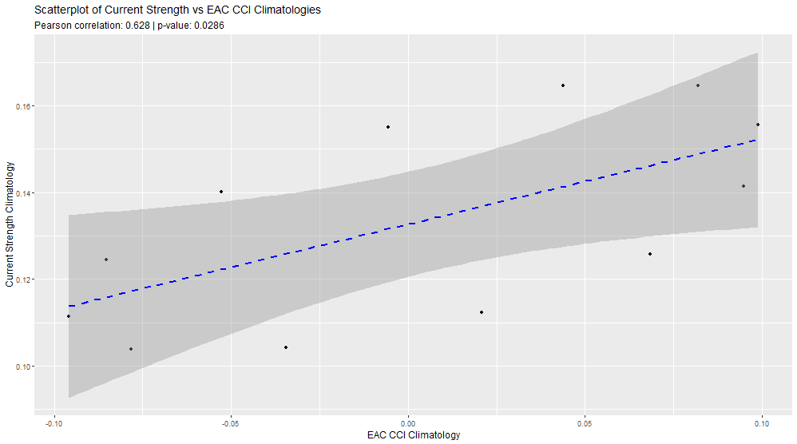
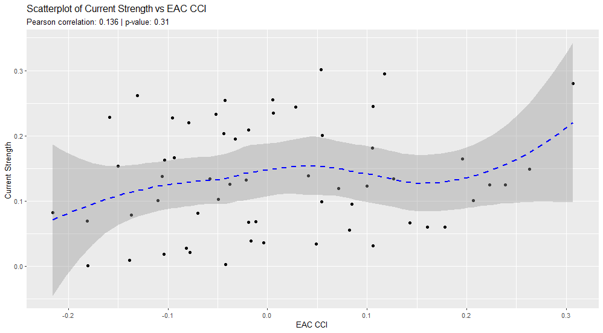
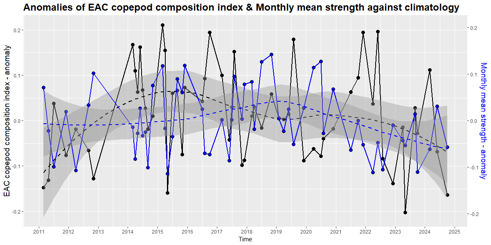
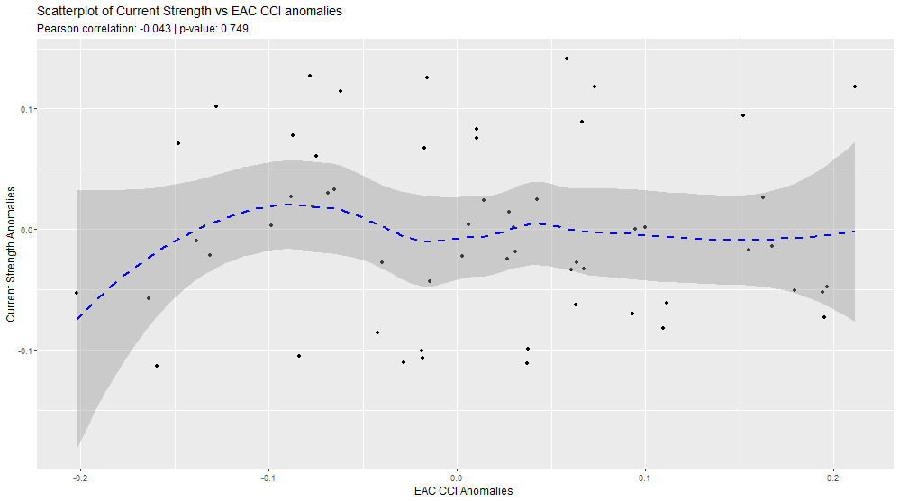

```{r}
# load libraries  
library(tidyverse) 
library(marginaleffects) 
library(gglm)
```

## Results

### Climatology comparison

The climatologies of the Index and the Mean Monthly Strength had a significant correlation between them (Pearson correlation = 0.628, p = 0.0286).

{alt="Climatology comparison between EAC CCI and Mean Monthly Strength"}

{alt="Scatterplot of the climatologies"}

### Relationship between Index values and Mean Monthly Strength

The raw values of the two were compared, however there was not a strong correlation between the two (Pearson = 0.136, p = 0.31)

{alt="Scatterplot of Index values against Mean Monthly strength values"}

To further explore the relationship between the output of the Index and the calculated mean monthly strength values, multiple linear regression models were calculated.

#### Raw: EAC strength vs. copepod index

```{r}


# data wrangling

# Extract data sources
raw_data <- readRDS(file.path("var", "raw_data_list.rds"))

raw_strength_data <- raw_data$raw_strength_data
raw_index_data <- raw_data$raw_index_data

# combine raw data values

comb_raw_data <- raw_strength_data %>% 
  full_join(raw_index_data, by = "date") %>%  # inner join to remove NA values
  mutate(
    month = month(date) # extract month value
  ) %>% 
  rename(mean_strength = mean_vel) %>% 
  filter(!is.na(mean_strength) & !is.na(eac_cci))

head(comb_raw_data)

# pivot longer for model

comb_raw_data_long <- comb_raw_data %>% 
  pivot_longer(cols = c(mean_strength, eac_cci),
               names_to = "data_source",
               values_to = "value") 

comb_raw_data_long$month <- as.factor(comb_raw_data_long$month)

head(comb_raw_data_long)
```

data_source is whether the values come from the output of the EAC CCI Index calculation or are the Mean monthly strength values from the Copernicus Global Ocean Physics Reanalysis <https://data.marine.copernicus.eu/product/GLOBAL_MULTIYEAR_PHY_001_030/description>.

There are no samples taken in January, so the data only covers the period from February to December.

```{r}
ggplot(data = comb_raw_data_long, aes(x = data_source, y = value)) +
  geom_jitter(data = comb_raw_data_long,
             aes(x = data_source, y = value), width = 0.2, alpha = 0.3)
```

A multiple linear regression was conducted to examine the effects of the data source, month, and their interaction on the resulting values.

```{r}

# create the model

raw_data_model <- lm(value ~ data_source * month, data = comb_raw_data_long)

summary(raw_data_model)

```

The overall model was statistically significant, *F*(21, 94) = 6.128, *p* \< 0.001, explaining approximately 48.4% of the variance in the dependent variable (*R²* = 0.5779, adjusted *R²* = 0.486).

Residuals were symmetrically distributed with a standard error of 0.08567 (df = 94), ranging from -0.223 to 0.214, suggesting that the model does not under or overfit.

A second regression was conducted to remove the effect of the interaction between data source and month.

```{r}
# drop the interaction term
raw_data_model2 <- lm(value ~ data_source + month, data = comb_raw_data_long)

summary(raw_data_model2)

```

This model was also statistically significant, F(11, 104) = 7.973, p \< 0.001, explaining approximately 40% variance in the dependent variable (*R²* = 0.458, adjusted *R²* = 0.4).

-   The main effect of data source was statistically significant (*β* = 0.1199, *t* = 6.995, *p* \< 0.001).

Residuals were symmetrically distributed with a standard error of 0.09233, ranging from -0.181 to 0.188.

To assess whether the interaction between month and the source of data significantly improves the model fit, an analysis of variance (ANOVA) was conducted comparing two nested models:

-   **Model 1**: included main effects of `data_source` and `month`, as well as their interaction (`month:data_source`).

-   **Model 2**: included only the main effects of `data_source` and `month`.

```{r}
# compare the two models 

anova(raw_data_model, raw_data_model2, test = "F")
```

The comparison revealed that Model 1 provided a significantly better fit to the data than Model 2, *F*(10, 94) = 2.68, *p* = 0.006.

This suggests that the seasonal trends differs between the index and the strength values.

Diagnostics of Model 1 show that the values have a fairly normal distribution. There is however, an unusual point in the leverage plot.

```{r}

# look at model 1

gglm(raw_data_model)


```

A plot showing the model’s predicted values for different months and data sources, overlaid with actual raw data points using jitter to visualize the model's fit to the observed data.

```{r}


plot_predictions(raw_data_model, condition = c('month', 'data_source')) +
  geom_jitter(data = comb_raw_data_long,
             aes(x = month, y = value), width = 0.2, alpha = 0.3)
```

The two have climatologies that are different,

#### Data transformation

```{r}
# log transform the data

comb_raw_data_long <- comb_raw_data_long %>%
  mutate(log1pvalue = ifelse(value >= -1, log1p(value), NA))

head(comb_raw_data_long)

```

Redo the linear regression with the log transformed values

```{r}

# create the model

raw_data_model_log <- lm(log1pvalue ~ data_source * month, data = comb_raw_data_long)

summary(raw_data_model_log)

gglm(raw_data_model_log)
```

```{r}
# create the model

raw_data_model_log2 <- lm(log1pvalue ~ data_source + month, data = comb_raw_data_long)

summary(raw_data_model_log2)

# compare the two models 

anova(raw_data_model_log, raw_data_model_log2, test = "F")
```

The model with the interaction included explains significantly more of the variation in the data.

Using the AIC, the two best models of the log-transformed data and the non-log-transformed data were compared to determine whether the log-transformed data provides a better explanation.

```{r}
AIC(raw_data_model, raw_data_model_log)
```

The model without the log transformations has a lower AIC value, suggesting that it is a better fit.

## Mooring Array

## Comparing the anomalies

Anomalies were calculated by subtracting the climatology value from the strength/index value, for example, `strength_anom = mean_str - str_clim`.





There was no correlation between the two (Pearson correlation = -0.043, p = 0.749).

```{r}

# Extract data sources
combined_anomaly_data <- readRDS(file.path("var", "combined_anomalies.rds"))

head(combined_anomaly_data)

```

The combined_anomalies2 tibble has 2 key variables:

1.  index_anom : The Index anomalies

2.  strength_anom : The strength anomalies calculated from the Copernicus data

```{r}
# prepare data for analysis
combined_anomaly_data <- combined_anomaly_data %>% 
  mutate(month = month(trip_month)) 

head(combined_anomaly_data)  

combined_anomaly_data_long <- combined_anomaly_data %>% 
  pivot_longer(cols = c(index_anom, strength_anom),
               names_to = "anomaly_type",
               values_to = "value") 

combined_anomaly_data_long$month <- as.factor(combined_anomaly_data_long$month)


head(combined_anomaly_data_long)


```

```{r}
# model to compare the anomalies of the Index and the Strength values
anomaly_model <- lm(value ~ anomaly_type * month, data = combined_anomaly_data_long)

summary(anomaly_model)

```

The model was not statistically significant, *F*(21, 94) = 1.47, *p* = 0.1081, and explained only a 7.9 %of the variance in the Index anomalies (*R²* = 0.247, adjusted *R²* = 0.079).

The residuals were approximately symmetrically distributed, with a standard error of 0.0851, and ranged from -0.223 to 0.214.

Neither anomaly type, month, nor their interaction had a significant effect on value**.**

```{r}
# model to compare the anomalies of the Index and the Strength values
anomaly_model2 <- lm(value ~ anomaly_type + month, data = combined_anomaly_data_long)

summary(anomaly_model2)
```

The model was not statistically significant, *F*(11, 104) = 1.245, *p* = 0.2675, and explained only 2.3 % of the variance in the Index anomalies (*R²* = 0.116, adjusted *R²* = 0.023).

The residuals were approximately symmetrically distributed, with a standard error of 0.0851, and ranged from -0.209 to 0.205.

```{r}
gglm(anomaly_model)

gglm(anomaly_model2)

```

## North vs South

```{r}
# load north and south data
cci_data_n <- readRDS(file.path("var", "eac_cci_north.rds"))

samples_n <- cci_data_n$samples
rda_fit_n <- cci_data_n$rda_fit
lm_fit_n <- cci_data_n$lm_fit
climatology_n <- cci_data_n$climatology
month_data_n <- cci_data_n$month_data # monthly average Index value

cci_data_s <- readRDS(file.path("var", "eac_cci_south.rds"))

samples_s <- cci_data_s$samples
rda_fit_s <- cci_data_s$rda_fit
lm_fit_s <- cci_data_s$lm_fit
climatology_s <- cci_data_s$climatology
month_data_s <- cci_data_s$month_data # monthly average Index value

```
